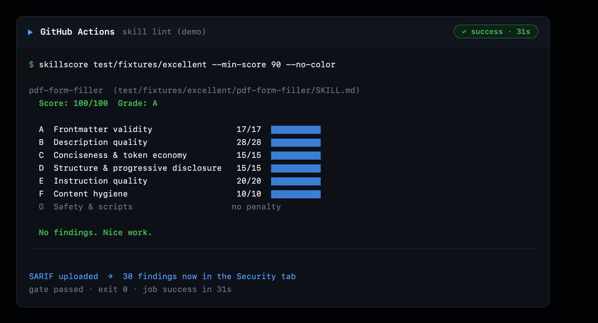
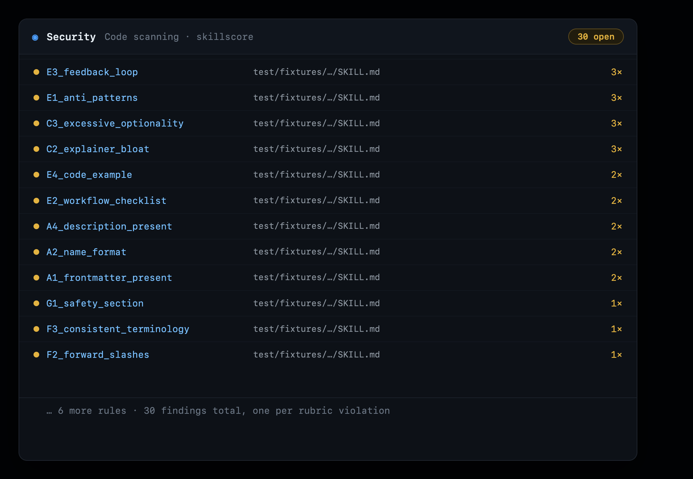

# Gate skill quality in CI/CD

A `SKILL.md` that is vague, malformed, or over budget is worse than no skill: an
agent carries every skill's `name` and `description` in its context on every
single prompt, so a bad one taxes every call and can misroute the agent. The fix
is the same one you already use for code: **make quality a gate**. Score every
skill on every push, and fail the build when one drops below the bar.

skillscore is built for exactly this. It is a single offline binary with
CI-friendly exit codes, a `--min-score` gate, and **SARIF 2.1.0** output that
GitHub renders as inline pull-request annotations. This guide shows the universal
recipe, then the exact config for ten CI/CD platforms, with real runs on GitHub
Actions and Google Cloud Build.

<p align="center">
  
</p>

## The universal recipe

Every platform reduces to the same three moves. skillscore is a Dart CLI on
[pub.dev](https://pub.dev/packages/skillscore), so any runner with Dart (or the
container image) can use it.

```bash
# 1. install (any Dart 3.4+ runner)
dart pub global activate skillscore
export PATH="$HOME/.pub-cache/bin:$PATH"

# 2. gate: exit 1 if any skill scores below 80
skillscore skills/ --min-score 80 --no-color

# 3. optional: machine-readable reports for dashboards and code scanning
skillscore skills/ --format json  --no-color > skillscore.json
skillscore skills/ --format sarif --no-color > skillscore.sarif
```

**Exit codes are the whole contract:**

| Code | Meaning | Gate behavior |
|---|---|---|
| `0` | every skill met the bar | build passes |
| `1` | a skill scored below `--min-score`, or `--strict` found an error/warning, or an eval run failed | build fails |
| `2` | usage error (bad path, unreadable file, unknown flag) | build fails, fix the invocation |

`--no-color` keeps CI logs clean, `--strict` promotes warnings to failures, and
`--target claude|antigravity|codex|universal` picks the authoring guide.

## GitHub Actions

The complete workflow: gate on the score, then upload SARIF so findings show up
in the **Security** tab and annotate the pull request. The `if: always()` steps
make sure the report is uploaded even when the gate fails.

```yaml
# .github/workflows/skills.yml
name: skill quality
on: [push, pull_request]
jobs:
  skillscore:
    runs-on: ubuntu-latest
    permissions:
      contents: read
      security-events: write
    steps:
      - uses: actions/checkout@v4
      - uses: dart-lang/setup-dart@v1
      - run: dart pub global activate skillscore
      - name: Score and gate
        run: skillscore skills/ --min-score 80 --no-color
      - name: SARIF report
        if: always()
        run: skillscore skills/ --format sarif --no-color > skillscore.sarif
      - name: Upload SARIF
        if: always()
        uses: github/codeql-action/upload-sarif@v3
        with:
          sarif_file: skillscore.sarif
```

Prefer one line? Use the reusable composite action, which does setup, install,
and the gate for you:

```yaml
      - uses: actions/checkout@v4
      - uses: sayed3li97/skillscore@v1
        with:
          paths: skills/
          min-score: "80"
          sarif-file: skillscore.sarif
      - if: always()
        uses: github/codeql-action/upload-sarif@v3
        with:
          sarif_file: skillscore.sarif
```

This is not a mock-up. The example below ran on this repo's own Actions.
The gate scored the excellent fixture 100/A and passed (exit 0), and the
SARIF step uploaded 30 findings:

<p align="center">
  
</p>

Those 30 findings become **code scanning alerts**, each mapped to a rule and a
`SKILL.md` line, so they annotate the pull request under the Security tab:

<p align="center">
  
</p>

The run is public: [actions/runs/29041629434](https://github.com/sayed3li97/skillscore/actions/runs/29041629434).
The full working workflow is [`examples/skill-lint.yml`](examples/skill-lint.yml).

## Google Cloud Build

Cloud Build is a clean way to run the gate on Google's infrastructure with **no
server to manage and nothing to tear down**: the container runs, the build
finishes, and the environment disappears. It sits well inside the free tier.

```yaml
# cloudbuild.yaml
steps:
  - name: dart:stable
    entrypoint: bash
    args:
      - -c
      - |
        dart pub global activate skillscore
        export PATH="$$HOME/.pub-cache/bin:$$PATH"
        skillscore skills/ --min-score 80 --no-color
options:
  logging: CLOUD_LOGGING_ONLY
```

```bash
gcloud builds submit --config cloudbuild.yaml .
```

The `$$` escapes a literal `$` for Cloud Build's substitution, and
`logging: CLOUD_LOGGING_ONLY` means the build needs no logs bucket or extra IAM.
The config in [`cloudbuild.yaml`](cloudbuild.yaml) is ready to submit; Cloud
Build needs a billing account attached to the project (the run itself stays
inside the free tier), after which `gcloud builds submit` scores your skills in
an ephemeral container and leaves nothing behind.

## Every other platform

The same recipe, in each platform's dialect. Full files live under
[`docs/ci/`](.).

**GitLab CI** ([`.gitlab-ci.yml`](.gitlab-ci.yml))

```yaml
skillscore:
  image: dart:stable
  script:
    - dart pub global activate skillscore
    - export PATH="$HOME/.pub-cache/bin:$PATH"
    - skillscore skills/ --min-score 80 --no-color
```

**CircleCI** ([`.circleci/config.yml`](circleci-config.yml))

```yaml
jobs:
  skillscore:
    docker: [{ image: dart:stable }]
    steps:
      - checkout
      - run: dart pub global activate skillscore
      - run: export PATH="$HOME/.pub-cache/bin:$PATH" && skillscore skills/ --min-score 80 --no-color
```

**Jenkins** ([`Jenkinsfile`](Jenkinsfile))

```groovy
pipeline {
  agent { docker { image 'dart:stable' } }
  stages {
    stage('skillscore') {
      steps {
        sh 'dart pub global activate skillscore'
        sh 'export PATH="$HOME/.pub-cache/bin:$PATH" && skillscore skills/ --min-score 80 --no-color'
      }
    }
  }
}
```

**Azure Pipelines** ([`azure-pipelines.yml`](azure-pipelines.yml)) ·
**Bitbucket Pipelines** ([`bitbucket-pipelines.yml`](bitbucket-pipelines.yml)) ·
**Travis CI** ([`.travis.yml`](.travis.yml)) ·
**Drone / Woodpecker** ([`.drone.yml`](.drone.yml)) all follow the identical
three steps inside a `dart:stable` container; open each file for the copy-paste
version.

## Before the push: pre-commit

Catch a bad `SKILL.md` before it ever reaches CI. skillscore ships a
[pre-commit](https://pre-commit.com) hook:

```yaml
# .pre-commit-config.yaml
repos:
  - repo: https://github.com/sayed3li97/skillscore
    rev: v0.8.0
    hooks:
      - id: skillscore
        args: ["--no-color", "--min-score", "80"]
```

The `skillscore` hook needs the CLI on `PATH`
(`dart pub global activate skillscore`). No Dart on the machine? Use the
`skillscore-docker` hook instead, which pulls the published image and needs only
Docker.

## The container image

For any container-based runner (or the Docker pre-commit hook), the published
image carries skillscore with no Dart setup:

```bash
docker run --rm -v "$PWD:/work" -w /work \
  ghcr.io/sayed3li97/skillscore skills/ --min-score 80
```

The image is built and pushed to GHCR on every release by
[`docker-publish.yml`](../../.github/workflows/docker-publish.yml).

## Which should you use?

| You are on | Use | Notes |
|---|---|---|
| GitHub | the composite action + `upload-sarif` | findings annotate the PR under Security |
| GitLab / Bitbucket / Azure / Drone | the `dart:stable` container recipe | keep the JSON report as an artifact |
| Jenkins | the `Jenkinsfile` with the Docker agent | needs the Docker Pipeline plugin |
| Google Cloud | Cloud Build | ephemeral, free tier, nothing to tear down |
| Any container CI | `ghcr.io/sayed3li97/skillscore` | zero setup, no Dart install |
| Local, pre-push | the pre-commit hook | fail fast before CI |

Whatever the platform, the gate is one line: `skillscore <paths> --min-score N`.
Exit `1` blocks the merge, and `--format sarif` turns findings into review
comments. That is all it takes to keep a fleet of skills honest.
