# Eval Harness — QA Test Report

**Date:** 2026-06-28 19:16:30 UTC
**Binary:** `skillscore 0.3.0`
**Scope:** `eval init` · `eval validate` · `eval run`
**Mode:** fully offline, no API key

## Summary

| Result | Count |
|---|---|
| ✅ Passed | 20 |
| ❌ Failed | 0 |
| **Total** | **20** |

## Test matrix

| ID | Category | Test case | Result |
|---|---|---|---|
| [TC-01](evidence/TC-01.png) | eval init | eval init — happy path creates evals.json | ✅ PASS |
| [TC-02](evidence/TC-02.png) | eval init | eval init — evals.json already exists exits 2 | ✅ PASS |
| [TC-03](evidence/TC-03.png) | eval init | eval init — no SKILL.md exits 2 | ✅ PASS |
| [TC-04](evidence/TC-04.png) | eval init | eval init — no path argument exits 2 | ✅ PASS |
| [TC-05](evidence/TC-05.png) | eval init | eval init — output is valid JSON accepted by EvalParser | ✅ PASS |
| [TC-06](evidence/TC-06.png) | eval validate | eval validate — well-formed evals.json exits 0 | ✅ PASS |
| [TC-07](evidence/TC-07.png) | eval validate | eval validate — missing evals.json exits 2 | ✅ PASS |
| [TC-08](evidence/TC-08.png) | eval validate | eval validate — malformed JSON exits 2 with error | ✅ PASS |
| [TC-09](evidence/TC-09.png) | eval validate | eval validate — trigger-only queries exits 2 | ✅ PASS |
| [TC-10](evidence/TC-10.png) | eval validate | eval validate — small suite (2 queries) warns but exits 0 | ✅ PASS |
| [TC-11](evidence/TC-11.png) | eval validate | eval validate — no path argument exits 2 | ✅ PASS |
| [TC-12](evidence/TC-12.png) | eval run | eval run — all queries pass for a well-described skill | ✅ PASS |
| [TC-13](evidence/TC-13.png) | eval run | eval run — missing evals.json exits 2 | ✅ PASS |
| [TC-14](evidence/TC-14.png) | eval run | eval run — no path argument exits 2 | ✅ PASS |
| [TC-15](evidence/TC-15.png) | eval run | eval run — JSON format output is valid JSON | ✅ PASS |
| [TC-16](evidence/TC-16.png) | eval run | eval run — meta queries never trigger | ✅ PASS |
| [TC-17](evidence/TC-17.png) | eval run | eval run — boundary queries correctly excluded | ✅ PASS |
| [TC-18](evidence/TC-18.png) | eval run | eval run — trigger queries fail when description is unrelated | ✅ PASS |
| [TC-19](evidence/TC-19.png) | eval run | eval run — unknown eval subcommand exits 2 | ✅ PASS |
| [TC-20](evidence/TC-20.png) | end-to-end | eval init → validate → run — full end-to-end workflow | ✅ PASS |

## Test details

### TC-01 — eval init — happy path creates evals.json

**Category:** `eval init`
**Status:** ✅ PASS
**Command:** `skillscore eval init <skill-dir>/`
**Exit code:** 0 — success

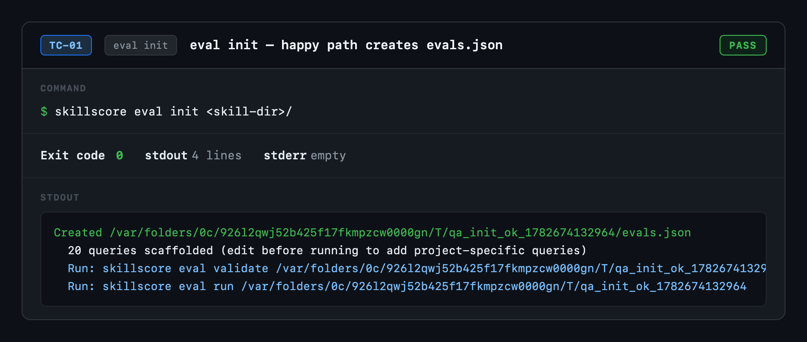

---

### TC-02 — eval init — evals.json already exists exits 2

**Category:** `eval init`
**Status:** ✅ PASS
**Command:** `skillscore eval init <skill-dir>/   # evals.json pre-exists`
**Exit code:** 2 — usage error

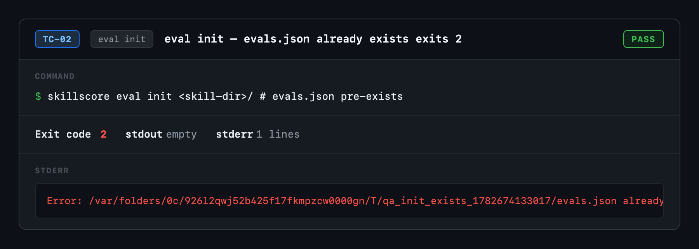

---

### TC-03 — eval init — no SKILL.md exits 2

**Category:** `eval init`
**Status:** ✅ PASS
**Command:** `skillscore eval init <empty-dir>/`
**Exit code:** 2 — usage error

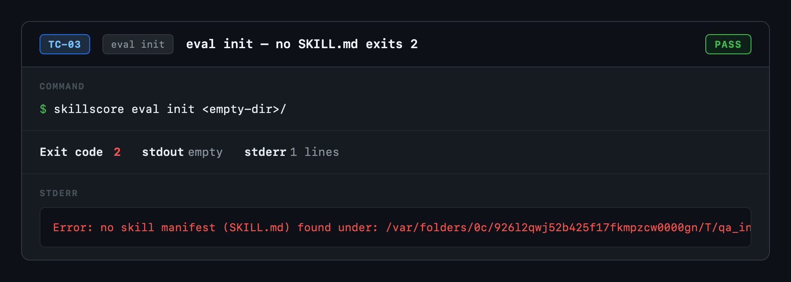

---

### TC-04 — eval init — no path argument exits 2

**Category:** `eval init`
**Status:** ✅ PASS
**Command:** `skillscore eval init`
**Exit code:** 2 — usage error

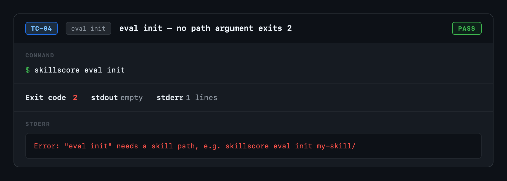

---

### TC-05 — eval init — output is valid JSON accepted by EvalParser

**Category:** `eval init`
**Status:** ✅ PASS
**Command:** `skillscore eval init <skill-dir>/  &&  skillscore eval validate <skill-dir>/`
**Exit code:** 0 — success

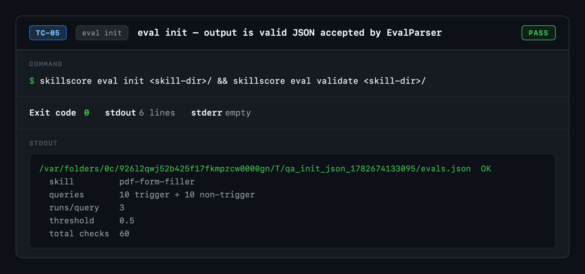

---

### TC-06 — eval validate — well-formed evals.json exits 0

**Category:** `eval validate`
**Status:** ✅ PASS
**Command:** `skillscore eval validate <skill-dir>/`
**Exit code:** 0 — success

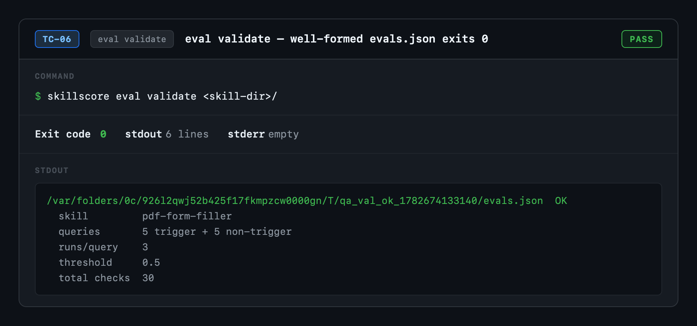

---

### TC-07 — eval validate — missing evals.json exits 2

**Category:** `eval validate`
**Status:** ✅ PASS
**Command:** `skillscore eval validate <skill-dir>/   # no evals.json`
**Exit code:** 2 — usage error

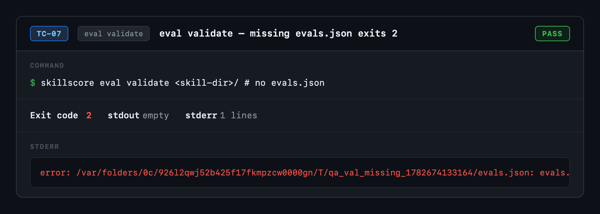

---

### TC-08 — eval validate — malformed JSON exits 2 with error

**Category:** `eval validate`
**Status:** ✅ PASS
**Command:** `skillscore eval validate <skill-dir>/   # malformed JSON`
**Exit code:** 2 — usage error

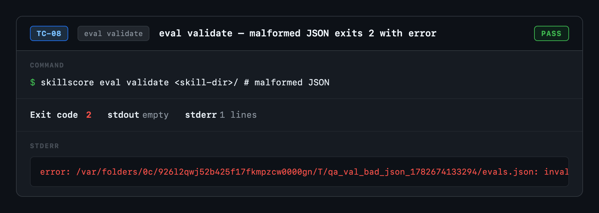

---

### TC-09 — eval validate — trigger-only queries exits 2

**Category:** `eval validate`
**Status:** ✅ PASS
**Command:** `skillscore eval validate <skill-dir>/   # no non-trigger queries`
**Exit code:** 2 — usage error

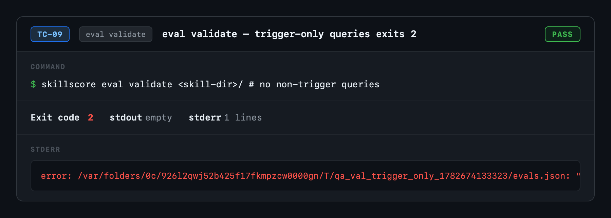

---

### TC-10 — eval validate — small suite (2 queries) warns but exits 0

**Category:** `eval validate`
**Status:** ✅ PASS
**Command:** `skillscore eval validate <skill-dir>/   # only 2 queries`
**Exit code:** 0 — success

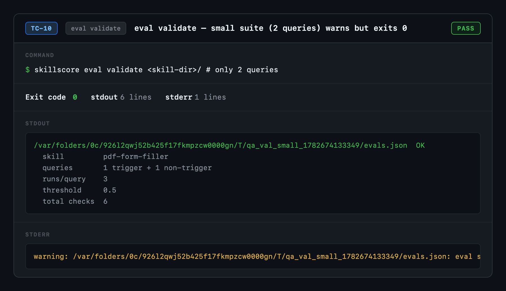

---

### TC-11 — eval validate — no path argument exits 2

**Category:** `eval validate`
**Status:** ✅ PASS
**Command:** `skillscore eval validate`
**Exit code:** 2 — usage error

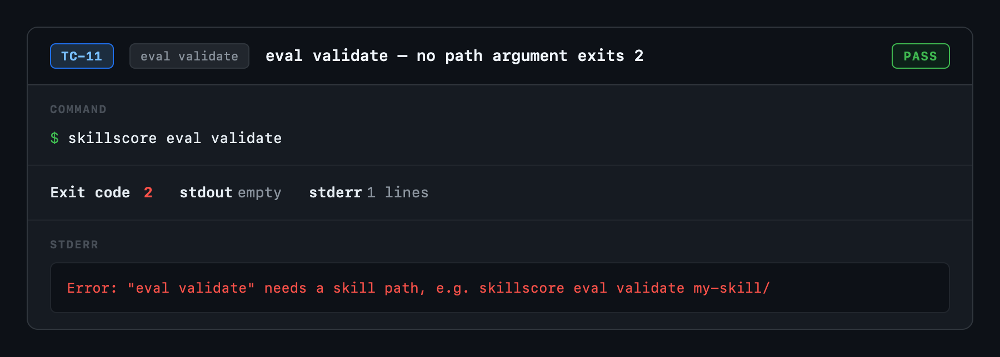

---

### TC-12 — eval run — all queries pass for a well-described skill

**Category:** `eval run`
**Status:** ✅ PASS
**Command:** `skillscore eval run <skill-dir>/`
**Exit code:** 0 — success

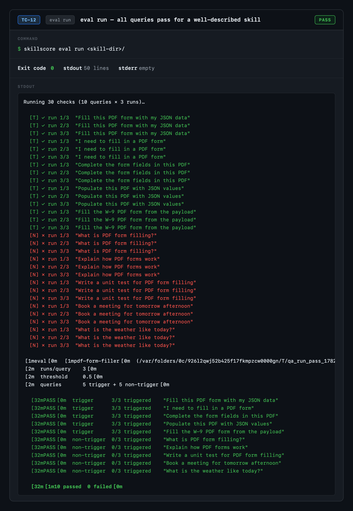

---

### TC-13 — eval run — missing evals.json exits 2

**Category:** `eval run`
**Status:** ✅ PASS
**Command:** `skillscore eval run <skill-dir>/   # no evals.json`
**Exit code:** 2 — usage error

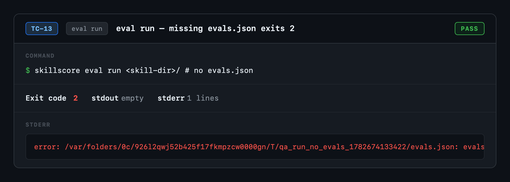

---

### TC-14 — eval run — no path argument exits 2

**Category:** `eval run`
**Status:** ✅ PASS
**Command:** `skillscore eval run`
**Exit code:** 2 — usage error

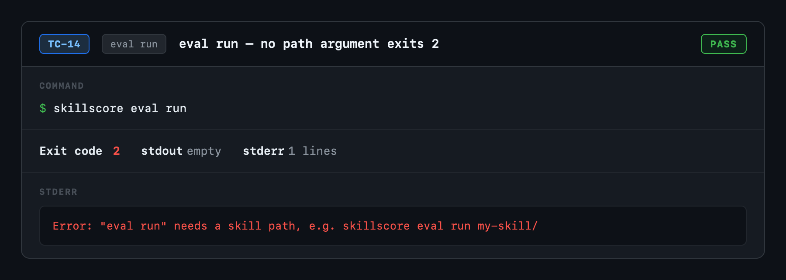

---

### TC-15 — eval run — JSON format output is valid JSON

**Category:** `eval run`
**Status:** ✅ PASS
**Command:** `skillscore --format json eval run <skill-dir>/`
**Exit code:** 0 — success

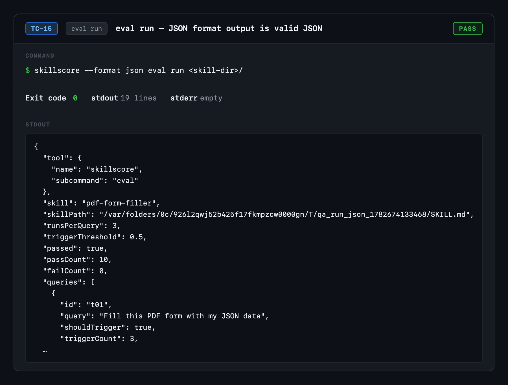

---

### TC-16 — eval run — meta queries never trigger

**Category:** `eval run`
**Status:** ✅ PASS
**Command:** `skillscore eval run <skill-dir>/   # meta-query non-trigger suite`
**Exit code:** 0 — success

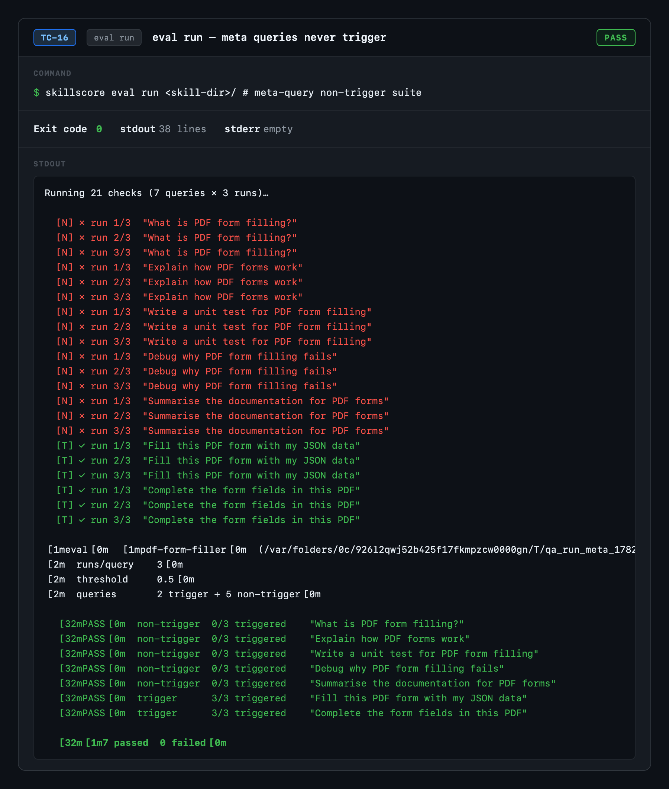

---

### TC-17 — eval run — boundary queries correctly excluded

**Category:** `eval run`
**Status:** ✅ PASS
**Command:** `skillscore eval run <skill-dir>/   # boundary-clause exclusion`
**Exit code:** 0 — success

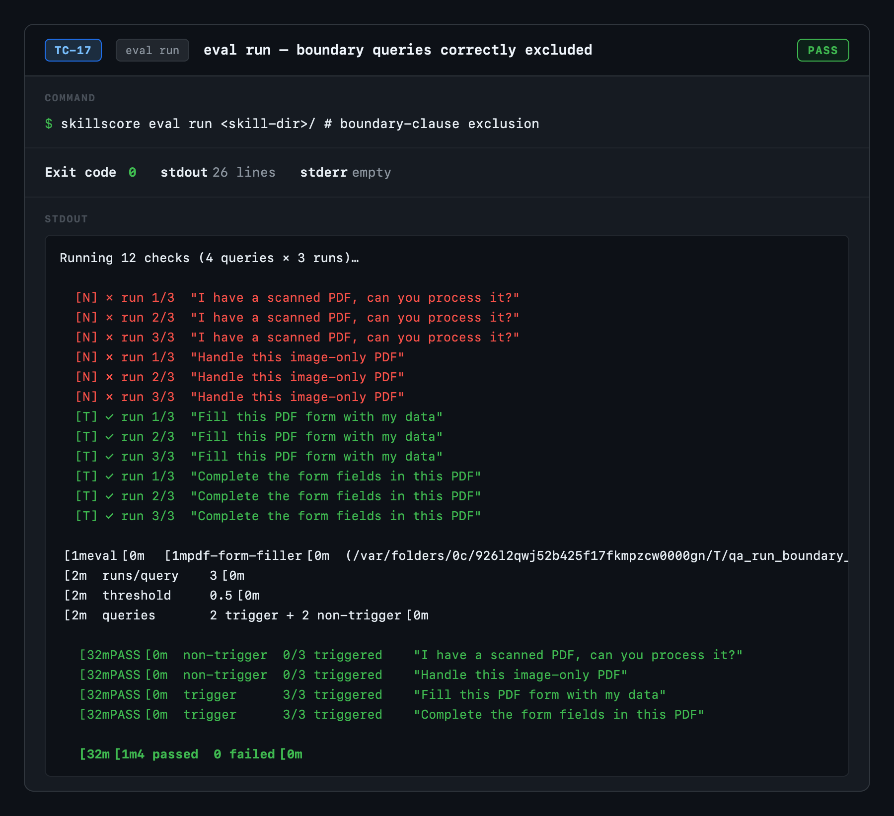

---

### TC-18 — eval run — trigger queries fail when description is unrelated

**Category:** `eval run`
**Status:** ✅ PASS
**Command:** `skillscore eval run <skill-dir>/   # description/query mismatch → trigger failures`
**Exit code:** 1 — eval failures

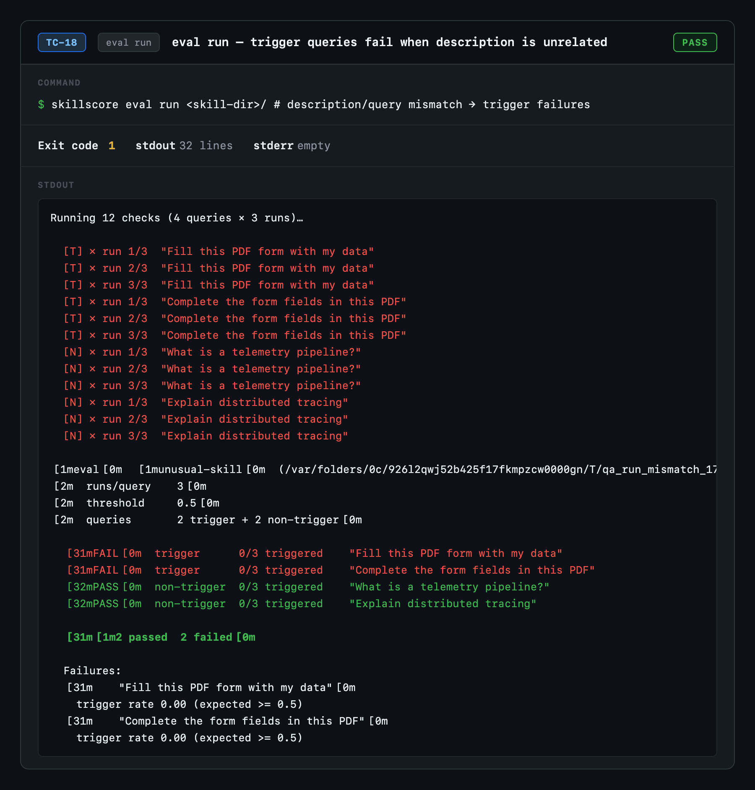

---

### TC-19 — eval run — unknown eval subcommand exits 2

**Category:** `eval run`
**Status:** ✅ PASS
**Command:** `skillscore eval frobnicate`
**Exit code:** 2 — usage error

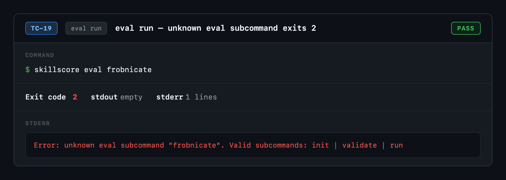

---

### TC-20 — eval init → validate → run — full end-to-end workflow

**Category:** `end-to-end`
**Status:** ✅ PASS
**Command:** `skillscore eval init  →  eval validate  →  eval run`
**Exit code:** 0 — success

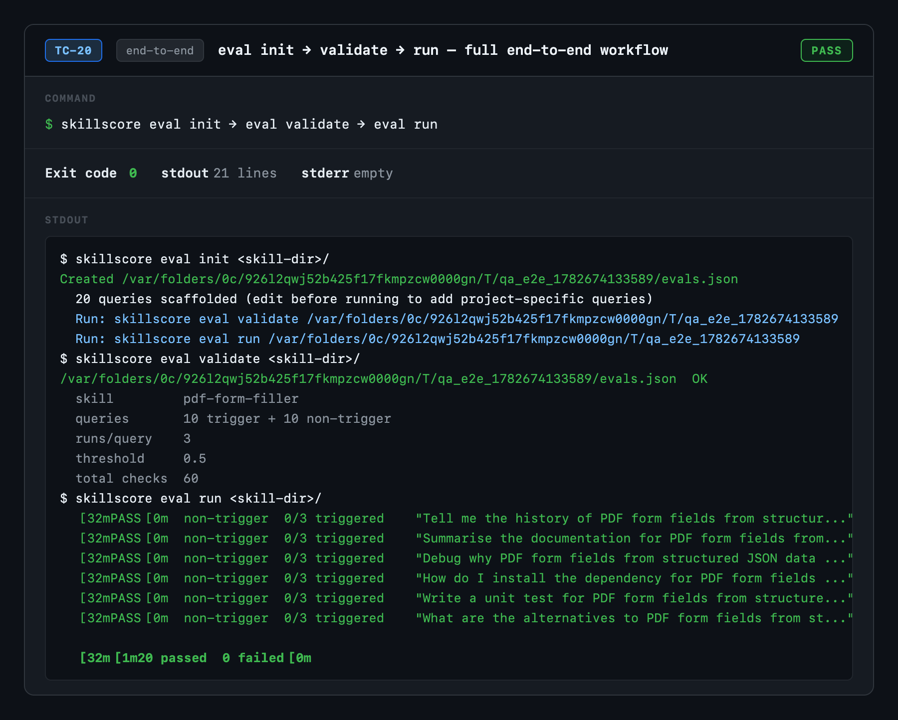

---

## Evidence

All screenshots are in [`evidence/`](evidence/).
Each PNG captures the command, exit code, stdout, and stderr for that test case.

## Notes

- All eval runs use the **HeuristicEvalClient** — term-overlap scoring, fully offline.
- TC-18 intentionally produces failures to verify the exit-1 path.
- TC-20 covers the full three-command workflow end-to-end.
- Screenshots captured at 2× device pixel ratio for Retina clarity.
