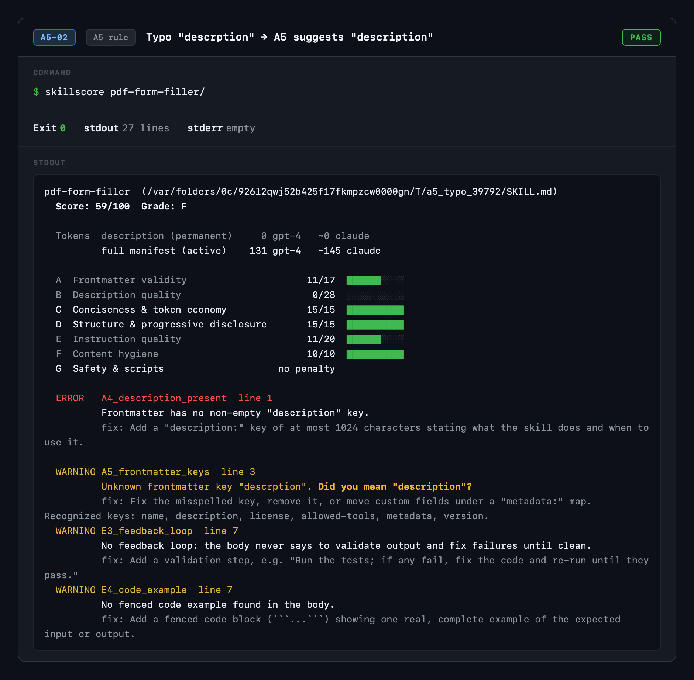
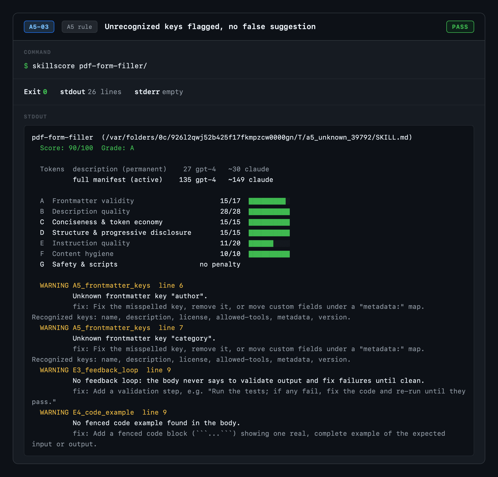
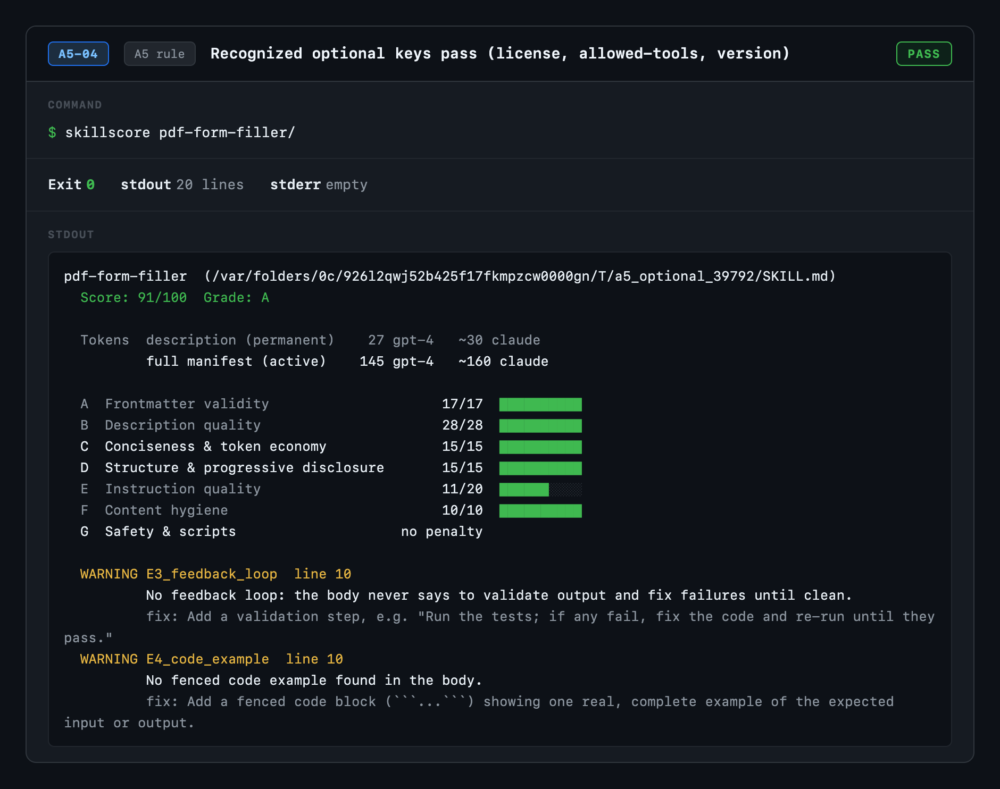
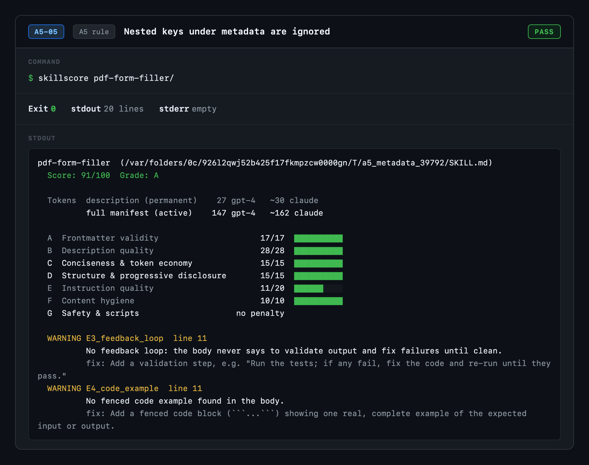
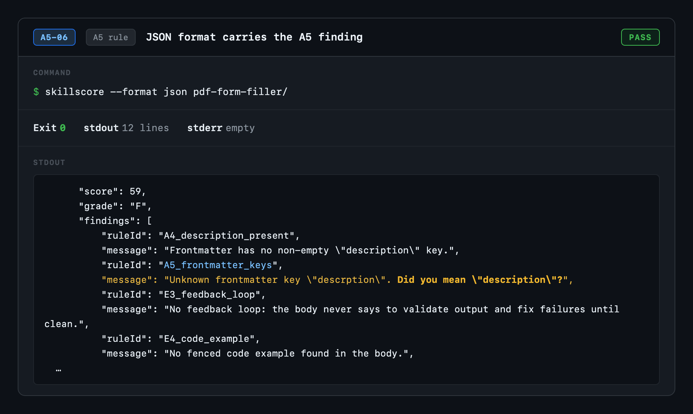
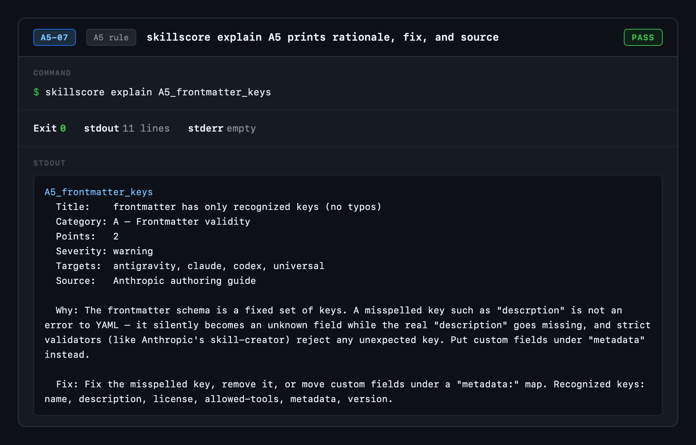
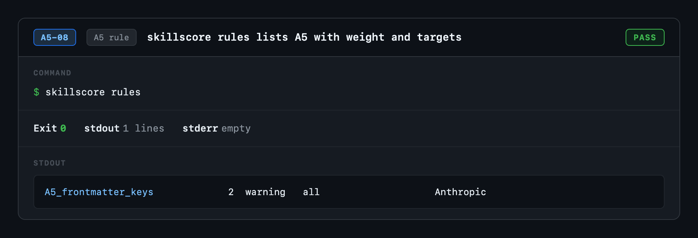

# Rule A5 (`A5_frontmatter_keys`) — QA Test Report

**Binary:** `skillscore 0.6.0`
**Rule:** `A5_frontmatter_keys` — unknown-frontmatter-key detection with "did you mean" suggestions
**Mode:** fully offline, deterministic

## Summary

| Result | Count |
|---|---|
| ✅ Passed | 8 |
| ❌ Failed | 0 |
| **Total** | **8** |

## Test matrix

| ID | Test case | Exit | Result |
|---|---|---|---|
| [A5-01](evidence/A5-01.png) | Clean frontmatter passes A5 (no unknown-key finding) | `exit 0` | ✅ PASS |
| [A5-02](evidence/A5-02.png) | Typo "descrption" → A5 suggests "description" | `exit 0` | ✅ PASS |
| [A5-03](evidence/A5-03.png) | Unrecognized keys flagged, no false suggestion | `exit 0` | ✅ PASS |
| [A5-04](evidence/A5-04.png) | Recognized optional keys pass (license, allowed-tools, version) | `exit 0` | ✅ PASS |
| [A5-05](evidence/A5-05.png) | Nested keys under metadata are ignored | `exit 0` | ✅ PASS |
| [A5-06](evidence/A5-06.png) | JSON format carries the A5 finding | `exit 0` | ✅ PASS |
| [A5-07](evidence/A5-07.png) | skillscore explain A5 prints rationale, fix, and source | `exit 0` | ✅ PASS |
| [A5-08](evidence/A5-08.png) | skillscore rules lists A5 with weight and targets | `exit 0` | ✅ PASS |

## Test details

### A5-01 — Clean frontmatter passes A5 (no unknown-key finding)

**Command:** `skillscore pdf-form-filler/`
**Exit code:** 0
**Result:** ✅ PASS

---

### A5-02 — Typo "descrption" → A5 suggests "description"

**Command:** `skillscore pdf-form-filler/`
**Exit code:** 0
**Result:** ✅ PASS

---

### A5-03 — Unrecognized keys flagged, no false suggestion

**Command:** `skillscore pdf-form-filler/`
**Exit code:** 0
**Result:** ✅ PASS

---

### A5-04 — Recognized optional keys pass (license, allowed-tools, version)

**Command:** `skillscore pdf-form-filler/`
**Exit code:** 0
**Result:** ✅ PASS

---

### A5-05 — Nested keys under metadata are ignored

**Command:** `skillscore pdf-form-filler/`
**Exit code:** 0
**Result:** ✅ PASS

---

### A5-06 — JSON format carries the A5 finding

**Command:** `skillscore --format json pdf-form-filler/`
**Exit code:** 0
**Result:** ✅ PASS

---

### A5-07 — skillscore explain A5 prints rationale, fix, and source

**Command:** `skillscore explain A5_frontmatter_keys`
**Exit code:** 0
**Result:** ✅ PASS

---

### A5-08 — skillscore rules lists A5 with weight and targets

**Command:** `skillscore rules`
**Exit code:** 0
**Result:** ✅ PASS

---

## Notes

- Every case runs the compiled `skillscore` binary against a crafted `SKILL.md` and captures the real terminal output.
- A5-01/04/05 confirm the rule stays quiet for clean, optional, and `metadata`-nested keys (no false positives).
- A5-02 verifies the Levenshtein "did you mean" suggestion; A5-03 confirms genuinely unknown keys are flagged without a misleading suggestion.
- A5-06 confirms the finding is present in `--format json`; A5-07/08 verify `explain` and `rules` surface the rule.
- Screenshots captured at 2× device pixel ratio.
